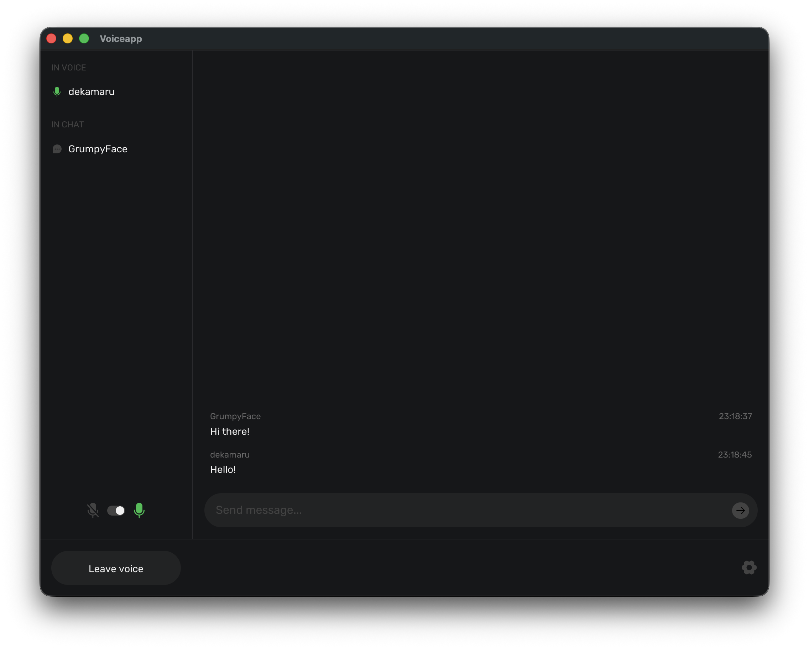

# VoiceApp

<!-- [](LICENSE) -->

A VoIP application written in Rust. Think Discord or TeamSpeak, but self-hosted and open-source.

> **Status**: Early Development

<div align="center">
  
</div>

## Table of Contents

- [Intro](#intro)
- [Features](#features)
- [Motivation](#motivation)
- [How to Start](#how-to-start)
- [Architecture](#architecture)
- [Acknowledgments](#acknowledgments)

## Intro

VoiceApp is a set of binaries that let you run your own voice chat:

- **[desktop](desktop)** - Reference desktop client built with the SDK
- **[server](server/README.md)** - Central server acting as both management and voice relay server
- **[sdk](sdk/README.md)** - SDK for building custom clients or integrations (includes encoding, resampling, networking)
- **[extras](extras/README.md)** - Additional tools

## Features

- 🎙️ Real-time voice communication with unlimited peers
- 👥 Multiple voice channels
- 🎧 Wide audio device support with auto-resampling
- ⚡ Lightweight custom binary protocol


## Motivation

I wanted to understand how voice communication actually works - not just use existing libraries (WebRTC), but build it from the ground up. This meant learning:

1. **VoIP from scratch** - How does audio get from your mic to someone else's speakers? Audio capture, Opus encoding, UDP networking, jitter buffers, resampling. All the pieces that make real-time voice work.

2. **Rust** - Systems programming with actual constraints: low latency, concurrent audio streams, memory safety. Using async/await for networking, dealing with FFI for audio libraries, understanding ownership in practice.

3. **AI-assisted development** - Writing code with LLMs as a tool. Learning prompting, using MCP servers, figuring out where AI helps and where it doesn't.

## How to Start

### Building

```bash
# Build the server
cargo build --release -p voiceapp-server

# Build the desktop client
cargo build --release -p voiceapp-desktop
```

### Running

```bash
# Start the server (runs on 127.0.0.1:9001 for management, 127.0.0.1:9002 for voice)
./target/release/voiceapp-server

# Start the desktop client
./target/release/voiceapp-desktop
```

## Architecture

Centralized server model. Easier to implement and avoids P2P issues like NAT traversal and bandwidth scaling (with P2P, each client sends to every other client).

- **Desktop Client**: GUI (iced), mic capture (cpal), Opus encoding, UDP for voice, TCP for presence
- **Server**: TCP for login/presence/channels, UDP relay for voice packets

## Acknowledgments

Huge thanks to:

- [Mikhail Kutsov](https://www.linkedin.com/in/mikhail-kutsov/) - For the desktop application design
- [iced](https://github.com/iced-rs/iced) - Cross-platform GUI framework that made building the desktop client possible
- [neteq](https://crates.io/crates/neteq) - Solid jitter buffer implementation that handles packet loss and timing
- [rubato](https://crates.io/crates/rubato) - High-quality and performant audio resampling, brings support for many devices
- [Phosphor Icons](https://phosphoricons.com/) - Icon family used throughout the UI
- [Rubik Font](https://fonts.google.com/specimen/Rubik) - Typeface used in the application
- [Rusu Gabriel](https://pixabay.com/users/skyscraper_seven-43500092) - For the sound effects used in UI notifications